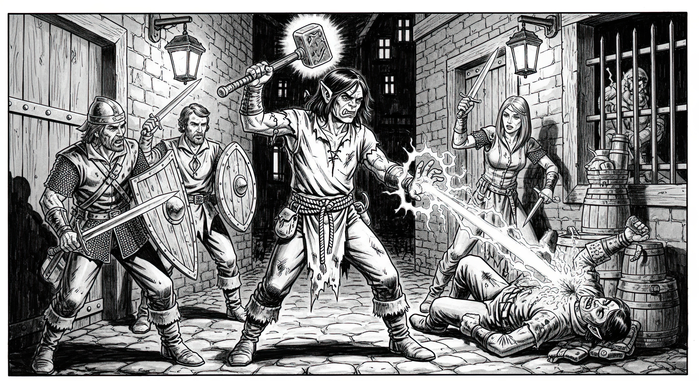

# Kragor Grimstride

I am Kragor Grimstride, orphan
of Bladegarden.
My parents
were proud orcs of the Righteous Brand,
fallen heroes who died
defending our city’s walls.
But hushed whispers
in the alleys
hinted at a darker truth—
betrayal, or sacrifices made in shadows.
At five years old,
none of that mattered.
Only the gnawing emptiness of my belly
and the cold stone streets
that became my home.

I was never as strong or clever
as the tyrannical bullies
who ruled the streets.
By deception, speed, stealth, and a silver tongue
I survived until adulthood.
Fortunately,
I was lucky enough
to be taken under the wing
by a grizzled, retired veteran
who had learned
the art of tattooing
while on tour near Xhorhas.
He taught me the skill,
and I scrapped together a few coppers
as an apprentice.
But my designs…
they were never truly my own.
Sometimes I would take up the needle,
and my hands would move
with a will I did not recognize,
etching abstract, strange, and unsettling glyphs.
Other than myself,
they interested only a few mages,
those who saw something beyond the ink on skin,
something that mirrored the unsettling stirrings
already taking root in my own mind.
My mentor, Dagmuk,
who taught me
how to manifest these designs
on my skin and others’,
often said I had a “touch for the unseen.”
He couldn’t have known
how literal that would become.

Even as I navigated
the tangible threats of Bladegarden
and the daily grind of survival,
a far more insidious struggle
began to unfold
in the dark expanse of my unconscious mind.
I don’t know why, or how,
but some presence… some thing…
from outside our realm
began whispering in my dreams—
discordant, incomprehensible words,
and images of impossible geometries.
For months these dreams plagued me,
a subtle, creeping insinuation
into the corners of my mind.
The murmurs were vague at first,
then became persistent,
a distant echo
of a vast, alien hunger
stirring far beyond my comprehension.

My darkest hour arrived one night.
After earning a decent sum from tattooing a wizard,
I boasted about my newfound wealth,
unaware that Brother Theron
and his Tuskbreakers were watching.
These thugs had terrorized
downtrodden orcs like me for years.
I was caught off guard
and struggled to fend them off,
but the blows rained down,
each one a hammer against my fading strength.
Blood filled my mouth.
The world tilted into darkness.
Feeble and desperate,
despising the weakness that had always plagued me,
my will to live burned hotter than ever.
Then the whispers
exploded into a roar
inside my skull—
an ancient will offering power beyond imagining.
I screamed and I surrendered.
Eldritch energy surged through my veins;
my eyes bled black.
The tattooed glyphs on my arms
burned with a cold light.
Muscles tensed unnaturally;
power crackled at my fingertips.
I didn’t just fight back—I unleashed a storm.
I obliterated one of the thugs
and sent the others scattering into the night,
their screams echoing my own.

Since then
dream visions continued
to haunt my slumber
and reveal the depth
of my awakened abilities.
With my war hammer raised
and eldritch energy crackling at my fingertips,
I fought against the street tyrants
at every opportunity,
protecting those they sought to exploit.

Gradually, the chaos of my dreams
began to coalesce into a chilling clarity—
a command, stark and undeniable,
and a promise of greater power.
“Go north. Cross the frozen north. To Eiselcross.”
The purpose remained a shrouded mystery,
yet a strange, cold resolve settled deep within me.
I would follow.

When I went to give Dagmuk
my farewell,
he was gone and his shop was empty, abandoned.
His tools were scattered
like forgotten memories.
A scorched parchment bore one of my glyphs.
An unspoken message?
A warning?
I felt a pang of loss
for the only person who believed in me.

I hit the road with a cover story.
A Righteous Brand veteran
now seeking his own fortune
was a tale that opened purses and secured passage.
Merchants, traders, wandering groups
paid for my protection,
though my true purpose
was survival.
Traveling alone meant certain death.
Joining caravans and groups
was a matter of strategic necessity.

Nights were the hardest—
when the cold bit through my cloak
and the whispers in my mind grew louder,
reminding me I was no mere soldier.
Dangerous encounters were rare,
but not nonexistent.
Most challenges
I met with a growl and a bluff,
my war hammer a sufficient deterrent.
But there were moments
when mere brute force wouldn’t suffice—
moments when I felt
the cold breath of death
on my neck.
It was then,
when my instincts screamed
that head-smashing is not enough,
I would unleash the alien power within me,
breaking the careful illusion of a simple veteran soldier.
The reactions were always the same:
a mix of shock, fear, and a quick retreat
as they recognized I was something else entirely.
They would scatter,
leaving me to continue
my calculated journey,
the whispers in my mind
a constant companion.

Four weeks
of winding roads and vicious winds
carried me from
Bladegarden,
through Nogvugrot, Rexxentrum, and Yrrosa.
Icehaven finally emerged from the Zemni Fields
like a promise.
Once I arrived,
I made bargain
with the first captain
who would take me.
The rest you know,
as we all met on board the _Frostwind_
on our way to Palebank Village.

## Appearance

_From the journal of a traveler, name unknown, recovered from a windswept road north of Saltwallow Bog:_

Of all the strange and disquieting souls one is fated to meet upon the winding roads of this world, few have etched themselves into my memory with such unnerving clarity as this singular orc. To look upon him is to read a page torn from two different books, one a gutter-dweller’s grimy chapbook, the other a tome bound in the skin of something that fell from the stars.

He calls himself Kragor Grimstride, a name that tastes of iron and long marches, and he wears the part with a practiced ease. The bearing of a soldier is there, in the straightness of his spine and the way his hand rests near the haft of a war hammer that seems, upon closer inspection, a trifle too heavy for him. He is an orc, yes— the mottled, greenish-gray skin, the dark architecture of his bones, the twin tusks jutting like broken daggers from his lower lip all attest to that.
He wore no mustache, but thick sideburns descended to a dark beard that framed a jaw of resolute strength.
He is a tower of a man, tall enough to cast a long shadow even in this wan light.

Yet, the illusion of the common sell-sword frays at the edges. Where one expects a bulwark of muscle, a physique hewn from granite, there is instead a certain wiry tension. He lacks the brutish mass of his kin; he is built not like a battering ram, but like a coiled whip, all lean sinew and a predator’s deceptive grace. His strength is not in the breadth of his shoulders, but in the quick, assessing flick of his gaze and the low, persuasive timbre of his voice. He has survived not by breaking skulls, but by turning heads and twisting words— a truth that clings to him more closely than the worn leather of his armor.

His face is a study in contradictions. The long, jet-black hair, drawn back in a severe topknot, speaks of discipline. But his eyes... his eyes are where the true madness begins to leak through. They are not the simple, brutish black or bloodshot red of his race. They are the color of a winter sea beneath a sky of impossible clarity, a startling aquamarine. And within that startling blue, flecks of gold drift like motes of dust in a sunbeam— or, if one stares too long, like the shattered script of some forgotten, cosmic alphabet. There is an unnerving depth there, a sense that one is not looking *at* his eyes, but *through* them, into a gulf of chilling, silent space.

And then, there are the tattoos.

They are not the proud clan-marks or crude battle-scrawls of a typical orc warrior. These are things of a different order entirely. They coil around his arms and spill across his collarbones, a filigree of stark black ink upon gray-green skin. At a glance, they might seem abstract, but to the discerning eye— or to the mind already teetering on the edge of certain esoteric truths— they are a disease made manifest in ink. They are a brand of unhallowed calligraphy.

There are no dragons, no skulls, no symbols of martial pride. There are only glyphs of a maddening, alien geometry. Spirals that seem to pull the eye into a lightless void. Angles that meet in ways that make the head ache. Lines that weave into patterns that suggest the skeletal framework of things that should not exist. They are not merely on his skin; they seem a part of it, and in the shifting light of the campfire, they sometimes appear to writhe, to shift their configuration ever so slightly when you are not looking directly at them. They whisper of a pact made not in blood, but in the currency of sanity itself.

He stands there, a charlatan of the mundane, his simple story a threadbare cloak thrown over a form scribbled with the signature of a lunatic god. He is an orphan, a veteran, a survivor. But he is also a vessel, a canvas for an artist whose studio is the void between worlds. One looks at Kragor Grimstride and sees a down-on-his-luck orc seeking his fortune, but one also feels an inexplicable chill, the same disquiet one feels when hearing a melody that is almost beautiful, but for a single, recurring, discordant note that promises only chaos and the dark.

## Relationships

- **Vargun the Steadfast**: Father. Righteous Brand veteran. Circumstances of death unknown.
- **Ursa Rune-sight**: Mother. Righteous Brand veteran. Circumstances of death unknown.
- **Dagmuk Rift-hand**: Mentor and tattooist. Righteous Brand veteran who served on the border near Xhorhas. Mysteriously disappeared after Kragor was summoned north by his patron.
