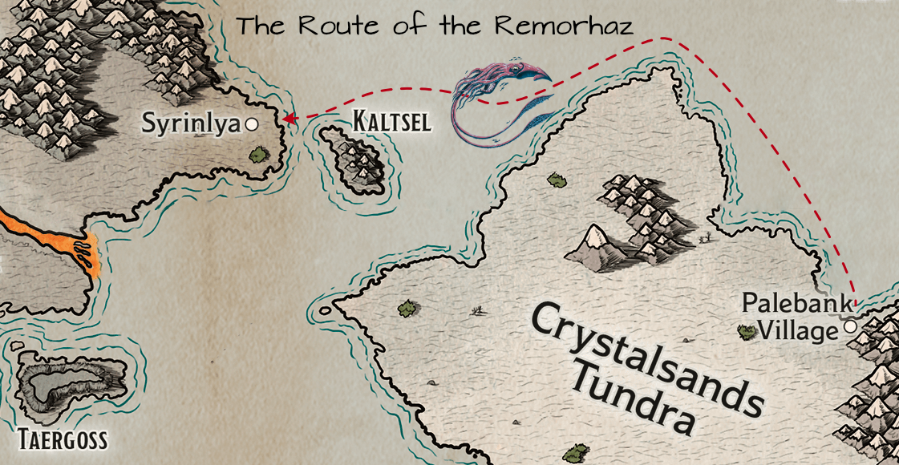

# Journey to Eiselcross

Dawn breaks on the fourth day of the adventurer’s journey across the Frigid Depths. A thick fog stretches endlessly before the Remorhaz, reducing the world to a spectral canvas of grays and whites. Visibility collapses to a mere fifty feet, transforming the sea into a claustrophobic realm where sound becomes more reliable than sight.

Chef Ingrid prepares a feast of gratitude. Massive platters of smoked fish, hearty breads, and steaming porridge cover the galley table, a culinary apology wrapped in steam and seasoning.

Pulling Whisper aside, Ingrid’s voice is soft, almost apologetic. “Sorry about the little nip,” she murmurs. “In that form, control is… challenging. I just like to chase cats.” A plate of poke—raw fish marinated in vibrant seasonings—appears, offered as both peace offering and cultural delicacy.

Captain Stonebeard’s voice cuts through the morning calm. “We need all eyes on deck!” The ship’s bell rings, a sonic marker declaring their position to potential listeners in this spectral seascape. “Passengers,” he commands, “keep your eyes over the rail. Raise the alarm if you spot anything that could lead to collision!”

Whisper and Haldor ascend to the crow’s nest, their keen eyes scanning the milk-white horizon. Distant sounds—perhaps other ship bells?—tantalize but remain uncertain, ghosts of noise within the fog.

The Remorhaz tracks southwest, meticulously avoiding island channels. Mera’s navigation is a dance of caution, each movement calculated to preserve their safety.

By noon, the crew strains to discern waves against distant shorelines, sound becoming their primary navigation tool. Stonebeard’s call for ballista expertise finds Halite ready, positioning himself with two other crew members, prepared for potential threats.

They reduce speed, approaching with heightened vigilance. Then—a bell, clear and sharp at first, then suddenly silenced.

Screams follow. Yelling. Shouted commands.

Sounds of crunching. Of cracking.

“Everyone! Eyes open!” Stonebeard roars.

Wreckage begins floating past—splintered wood, broken timbers. A massive mast segment drifts into view, three desperate souls clinging to its bulk.

And rising from the depths, a nightmare incarnate: a giant squid, tentacles reaching hungrily toward the survivors.

The Frigid Depths have claimed another ship as victim—and the Remorhaz stands between potential salvation and certain doom.

## Calamari, anyone?

The battlefield erupts in a symphony of magical and martial action, each crew member responding to the giant squid’s threat with their unique talents.

Kragor chants arcane words, “Mactē virtutē”. As the last word is uttered, a sudden chill surges through the air. A shimmering, icy aura begins to emanate from his form, enveloping him in a protective shell of frost. He then moves quickly to the ballista, grabs a large bolt, and loads it. Scarlet then springs to the weapon, her aim sharp and focused on the writhing tentacled horror.

A miraculous scene unfolds near the wreckage: one of the shipwrecked survivors lifts his companion, a ring sparkling eerily on his finger before he inexplicably sprints across the water’s surface, defying natural law.

Elara, quick-witted and creative, strums her harp to conjure a minor illusion— a tantalizing, hopefully seductive squid-form designed to confuse their monstrous attacker. As the form fully materializes, her harp strings continue to vibrate with an inspiring melody, empowering Halite with courage and skill.

“Shoot the bastard!” bellows Captain Stonebeard, commanding the crew. He raises his crossbow, but his shot goes wildly wide, sailing harmlessly into the fog.

Doctor Pepe, steadier of hand, takes aim and strikes true. His bolt finds purchase, drawing first blood and scoring a solid hit against the creature.

“I’ll bring us broadside!” Mera shouts, maneuvering the ship to attempt a rescue.

From below, Ingrid’s voice drifts up incongruously: “Anyone want a sandwich?”

The squid, momentarily confused by Elara’s illusion, probes it with a tentative appendage. Confused, it swings a large tentacle, but the attack passes right through the squid-that-is-not-there. Finally realizing the deception, it shifts focus and savagely attacks the boat, its powerful beak tearing into the hull with devastating force.

Benefiting from the inspiration Elara granted earlier, Halite unleashes the ballista, a devastating shot that tears into the squid’s massive form. The bolt rips through its flesh, but the creature remains terrifyingly active.

Whisper descends from the rigging to join the others on deck, then throwing her javelin with deadly precision. The creature writhes under the assault but doesn’t slow.

“Two in the water!” Ironfist shouts, attempting to throw a rescue rope to the figure strangely running across the water’s surface with another slung over his shoulder. The rope falls pathetically short, landing uselessly in the churning waves. Nonetheless, the water walking sailor closes the distance, and he and the companion he was carrying clambor up the rope onto the deck. As soon as he steadies himself, his eyes narrow, fixing on the squid with predatory intensity. A crimson thread of arcane energy faintly traces a trail to his chosen prey, marking it with an ethereal brand that he knows will make his every subsequent strike deadly.

Another human suddenly materializes on deck, adding to the chaotic battle… the third survivor of the shipwreck. By his garb, he is clearly a wizard. “By the gods, I’m glad you showed up!” he shouts to the crew. He reaches into his robes and pulls out a small dart along with something slimy looking. He rubs them together and suddenly a sickly shimmering green arrow streaks towards the squid. It lands just short of the mark, yet it splashes and the squid flinches as its skin sizzles where the corrosive magic touches.

Kragor stands firm upon the wooden deck, veins throbbing with dark energy. Sinister tendrils of unearthly mist coil and writhe from his fingers, weaving through the air like serpents drawn to their prey. An invisible curse ensnares the colossal squid, making its gaze falter, its monstrous tentacles flinch with an unseen dread. He then pivots to the ship’s ballista, muscles straining beneath his ragged cloak as he heaves the mighty weapon into position. The bolt flies with a crack of released tension, slicing through the air. It sinks deep into the beast’s flesh with a satisfying, primal thud.

Mera maneuvers the ship into a better firing position. Scarlet’s slender fingers trace intricate patterns in the air, drawing forth a mote of pure elemental fire that dances and trembles above her open palm— a spark of primal energy, bright and hungry. With a fluid motion born of wilderness training, she hurls the flame toward the squid’s writhing mass, the blazing projectile arcing through salt-laden wind before striking the creature’s membranous hide, erupting into a consuming conflagration that sears and blisters its pallid flesh.

“Get ready to aim and fire!” Captain Stonebeard bellows as he rapidly reloads the ballista. In that fleeting moment, Doctor Pepe emerges like a phantom, his bolt striking true into the squid’s vulnerable flank. The beast roars in pain, its thick, dark flesh quivering from the impact.

Enraged and wounded, the colossal squid reacts with malignant fury. Its writhing tentacles thrash through the salt-laden air, and one particularly vicious limb finds its mark on Elara, ensaring her. Her hands clutches at the slick, unyielding surface of the creature. The harp at her side falls silent as she struggles, caught in the squid’s vice-like grip.

Another abrupt strike from the squid’s beak leaves a gaping wound in the ship’s hull. Thick splinters and dislodged timbers bear silent witness to the beast’s brutal might. Amid the clamor of battle, Ingrid’s voice wafts upward from below, barely registering over the cacophony of combat: “Are you sure you wouldn’t like a sandwich?”

Halite’s broad arm hurls a javelin that whistles through the frigid air, colliding with one of the squid’s thick tentacles. The impact reverberates— a flash of victory as the creature recoils, wounded by the force of his strike. At the same moment, Whisper dashes to Elara’s aid. With feline agility, she slashes at the slimy appendage constricting her, her claws raking into its flesh. A burst of raw determination follows as she unleashes a flurry of attacks that loosen the tentacle’s grip enough for Elara to breathe, but not enough for her to escape.

Across the chaotic deck, Ironfist steadies himself and lines up the ballista, the massive weapon creaking as he aims it squarely at the disordered beast. Not far away, the wiry wizard, face alight with fervor and exhaustion, summons a bolt of shimmering blue energy. The air crackles with ozone as a sustained electric arc connects with the squid, sapping its monstrous vitality.

Kragor charges, hammer raised high in a wild swing, but his blow misses, clanging uselessly against the ship’s railing. Scarlet seizes the moment: she maneuvers nimble fingers over the ballista’s trigger, and its bolt flies ahead, striking home into the beast’s pulsating flesh with a resounding crash. Gerhard, the human ranger, then finds his focus. His longbow sings as an arrow arcs through the gloom, finding its target in one of the squid’s unblinking eyes.

Under the relentless assault, the colossal creature falters, its thrashing slowing until it releases Elara and finally sinks into the inky depths. After a gasp of relief, Elara calls out over the din to Ingrid below deck, her voice lilting and defiant, “Sandwiches for everyone!” A surreal endnote to the turmoil— a promise of warmth and camaraderie amid the unforgiving cold.

The crew methodically surveys the damage. The squid’s beak has carved a gaping maw in the ship’s hull, and the task of repair falls heavily on the remaining hands.

Whisper, nimble even in the lingering fear, takes to the rigging, aiding in the salvage operation. She peers into the depths, her vision unnervingly clear, but the fog obscures the scene.

The captain’s voice then rings clear over the ship’s hushed atmosphere. “We navigate dangerous waters, both seen and unseen,” he intones. “Keep your wits sharp and hearts steadfast.” The Remorhaz still sails, a floating island of survival amidst the chaos.

The decks, still slick with salt and remnants of battle, host a contrasting medley of weary heroes and newcomers. Quick introductions are made all around. The three survivors are Gerhard, former captain of the Frostfang; Rorik, former crew member; and Bret, former passenger.

Halite asks, “Well met. I am called Halite. What were you doing out here in the first place?”

Gerhard— a weathered, mid-thirties human with unkempt brown hair and a burgeoning beard— steps forward, his brown eyes reflecting both the hard-won relief and underlying caution of a sailor who has seen enough of these treacherous waters. “Thank you for being here,” he declares, voice edged with both gratitude and disbelief. “My family’s boat, Frostfang, I can’t believe it’s gone. This is crazy— That squid! I was going to die. And then … I ran across the water, carrying Rorik here. This family heirloom saved me. And that aasimar … she almost got killed! What the hell!”

A pair of younger eyes fix on him— his crew member, barely seventeen, whose wide gaze betrays both admiration and trepidation. Meanwhile Halite stands rigid, scrutinizing every syllable for traces of deceit. Halite’s suspicion cuts sharper than the chill in the air; he’s navigated enough peril to know that not all survivors bear honest scars. Clearly this sailor is not as unfamiliar with danger as he is letting on.

At the rail, a robed figure steps quietly forward. Kragor recognizes the sigils on his robe, a symbolic design of three inward-pointing diamond shapes with eight curling spires underneath. This wizard is a member of the Cerberus Assembly, a powerful conclave of mages in the Dwendalian Empire. He nods solemnly to Gerhard. “The sea tests us all,” he intones, his tone measured as though reciting an incantation. “Perhaps your misfortune portends a greater journey— one that may yet lead us to Eiselcross.”

Halite eyes Gerhard with suspicion. He knows the sea hides many secrets, and not all survivors tell the whole truth. He presses Gerhard for an explanation, wanting to know *exactly* what they were doing out here.

Gerhard’s breath hitched, a visible cloud in the frigid air. “My kin have plied these waters for generations. We serve, offering passage to those of import, and when the season allows, we draw our sustenance from the cold depths. Fishing… that was our life. For a time, aye, a long time. Just now, we were fishing for crab, when…” He faltered, his eyes darting across the ravaged deck as if seeking some solace in the wreckage. “We found a new means of securing our future: ferrying passengers.” He gestured toward the wizard, Bret. “That mage, the one you see there, offered a fortune in gold for his transport.”

Bret, indeed, is standing nearby, clearly agitated, his words laced with a demanding edge. “I require passage to Icehaven, Captain,” Bret declared, his voice tight with urgency. “I bear tidings of utmost import. The vessel we sailed upon is lost, and I must deliver my news without delay. I will provide recompense for the diversion of your ship.”

Stonebeard remained unmoved by the man’s pleas. His beard barely twitched as he surveyed the situation. “Such a course is impossible,” he rumbled, his voice a deep echo of the sea itself. “My obligations lie with the Glassblades, and my route must be followed. You may remain aboard, and upon completing our appointed rounds, we shall deposit you at Palebank Village. From there, another vessel can convey you to Icehaven. I am heartened that we were able to rescue you, and it is fortunate that you remain among the living. But do not expect more than what is offered.” He paused, a flicker of fatigue crossing his face. Then, his gaze fixed upon the traveler with steely resolve, he uttered a simple command: “Assist with the cleaning of the foredeck. There is work to be done.”

The afternoon fog still clings to the Remorhaz, a suffocating embrace that smothers the sea. The ship creeps onward, its pace reduced to a cautious crawl. Dead reckoning is the only option in this soup, and Mera navigates by the slimmest of margins.

Scarlet calls for Sparky, her owl companion. Sparky blinks, a flash of gold against the gray, and then takes flight. “Fly up, Sparky,” she commands, “and find the sun. Tell me how long it takes and look for land.”

Sparky beats its wings, rising rapidly, and disappears into the milky expanse. The crew watches, their faces etched with a mixture of hope and anxiety, waiting in anticipation for the owl’s return.

Three minutes pass. Then four. The rhythmic clap of the owl’s wings grows fainter, then vanishes. Silence descends once more.

Five minutes.

Six.

Seven.

Eight.

Then, as if on cue, Sparky reappears, a spectral shape against the fog. It circles and settles on Scarlet’s shoulder. The connection is reestablished, and Scarlet sees through Sparky’s eyes.

“It took them a while to get above the clouds,” Scarlet reports, her voice hushed. “And when they were up there… just clouds.”

She describes what she saw through her owl’s eyes: a sea of gray, stretching as far as the eye can see, with no visible land.

“They said there were tentacles in the water that smelled bad, like farts,” Scarlet chuckles.

The crew sighs, a collective exhalation of disappointment and a shared understanding of the bleak situation. The search continues, and hope is a fragile thing in the embrace of the fog.

The galley teems with activity. Chef Ingrid surveys the damage with a critical eye, her moon-and-rune amulet glinting in the flickering lamplight. Despite the recent chaos, a sense of camaraderie still pulses throughout the ship.

The evening unfolds, and the crew gathers, a melting pot of survivors and newcomers alike. Kragor, his brow furrowed in concentration, leans in, beginning to pepper the wizard Bret with questions, a relentless barrage of inquiries.

Bret, a man burdened by his own secrets, offers cautious replies. He folds his hands, his fingers interlaced, his tone careful. “I am bound by oaths to maintain discretion regarding my objectives within Eiselcross.” The wizard’s eyes dart around the galley, a telltale sign of his evasiveness.

Kragor remains undeterred, pressing his point. “But you were seeking passage to Icehaven, correct? And you mentioned…tidings of utmost import. Surely, some details can be shared.”

Bret sighs, his shoulders slumping slightly. “I can only say that we have uncovered valuable information within the frozen wastes and encountered some… Aeorian constructs. But my destination is of utmost importance. I require passage there.”

“Have you seen any gold vials by chance?” Kragor presses on.

Bret looks at him, his face devoid of emotion. “I assume you mean the antidote for the Frigid Woe? No. Fortunately, we did not come across that dreadful affliction.”

Elara, sensing the tension, attempts to lighten the mood. She raises her glass, a smile gracing her lips. “To new beginnings, and to surviving giant squids!” she declares, her voice ringing with cheer.

Laughter erupts, easing the weight of suspicion and intrigue. The crew celebrates, reveling in the camaraderie that defines their shared survival. The fog still clings to the Remorhaz, but within the confines of the ship, a warmth begins to bloom. The adventurers have a meal to eat and a ship full of friends.

Below decks, the scent of Ingrid’s promised feast begins to waft upwards, a strangely comforting aroma amidst the lingering scent of brine and something vaguely ammoniac left by their monstrous assailant. Sandwiches, it seems, are off the menu, replaced by the heartier fare promised earlier.

As the crew gathers in the galley, the three survivors—  Gerhard, Rorik, and Bret— are formally integrated into the temporary community forged by shared peril. Gerhard still looks stunned, his eyes periodically flicking towards the deck as if expecting to see the shattered remains of his life reappear from the mist. Rorik, barely a man, sticks close to Gerhard, while Bret, the wizard, maintains an air of detachment, observing the adventurers with guarded curiosity.

Scarlet approaches Gerhard, her expression sympathetic but her gaze direct. “Gerhard, you said your family has sailed these waters long? What is your family name, if you don’t mind my asking?”

Gerhard pulls his attention back from the grey void outside the porthole. “Eisner,” he replies, rubbing a hand over his burgeoning beard. “The Eisners of Icehaven. We’ve been fishing these parts for generations. Crabs, mostly. That boat… the Frostfang… she was everything.” He gestures vaguely towards the young Rorik. “My life, his livelihood… gone.” He sighs, a plume of condensation in the cool air. “We’d only recently started ferrying passengers. Trying to find a new way, you know? Bret here offered good coin for passage.”

“Is there somewhere… somewhere we might rest?” Gerhard asks, looking towards Captain Stonebeard, who stands surveying the gathered company, his face grim but resolute.

“Aye,” Stonebeard nods curtly. “We’ve bunks enough. You earned your place.”

As the survivors find spots at the galley table, laden now with Ingrid’s platters of smoked fish and steaming bread, the conversation naturally turns to the adventurers’ own quest. Halite, Kragor, and Elara briefly explain their mission: the Frigid Woe spreading from Palebank, the stolen Aeorian artifacts, Hulil’s desperation, and their current journey to Eiselcross seeking the cure Elro described— the milky liquid in golden vials. Gerhard and Rorik listen intently, their own recent brush with death making the tale of a magical freezing plague resonate deeply. Bret listens too, though his face remains impassive, betraying nothing.

Mera, the navigator, consults her charts, her brow furrowed in concentration. “With this fog and the delay… we lost time,” she announces to the room. “But if the weather holds after this lifts, we should reach Syrinlya by tomorrow afternoon.”

A collective sigh of relief ripples through the crew. Landfall is close.

Dinner is a subdued affair, punctuated by the recounting of the battle and the shared relief of survival. Later, as mugs are refilled and the warmth of the food settles in, Elara retrieves her harp. The instrument seems small against the backdrop of the vast, fog-bound sea, yet as her fingers touch the strings, a melody fills the galley, weaving a spell of quiet longing and resilient hope.

The notes hang in the air, a moment of fragile beauty against the harsh reality of their journey. Even Bret seems momentarily softened, his gaze distant. When the song ends, a respectful silence holds for a moment before dissolving into appreciative murmurs.

As the evening deepens, the routine of the ship reasserts itself. Watches are assigned. Scarlet takes the first, her senses attuned to the sighing wind and the groan of the timbers, Sparky a silent, feathered presence beside her. Whisper follows, melting into the shadows of the deck, her movements economical, her eyes piercing the gloom.

Gerhard takes the third watch, grateful for the task, a semblance of normalcy in a world turned upside down. Captain Stonebeard joins him near the helm, leaning against the railing, the fog swirling around them like ghosts.

“I am sorry about your vessel, Gerhard,” Stonebeard says, his voice low. “It’s a hard thing, losing your ship.”

Gerhard nods, staring into the white abyss. “Aye. She was a good boat. Fast. The boat I grew up on. My dad taught me how to fish on her.” He pauses. “Good thing I have good insurance.”

Stonebeard raises an eyebrow. “Insurance?”

“Aye. You’ve never found a wizard willing to take a few gold a month against the value of your hull? Got a good rate from a fellow in the Empire. Says if she sinks, he’ll buy me a new one. My family’s been doing it a long time.” He shrugs. “Still… devastating. But at least we’re not bankrupt.”

Stonebeard grunts, filing the information away. “Boats are indeed expensive. Taken many voyages on vessels like yours myself.” He shifts his weight. “Given the circumstances, saving your lives and all, there’ll be no charge for your passage to Palebank.”

Gerhard turns, a flicker of surprise, perhaps even offense, in his eyes. “No charge? Captain, with respect, that should be a given. Naval etiquette. Rescued souls aren’t passengers for fare.”

Stonebeard meets his gaze steadily. “My apologies. You are correct, of course. Force of habit.” He sighs, the sound weary. “Been a long few days.” He gestures vaguely towards the spot where Bret presumably sleeps below. “That squid… seemed focused. Almost like it was going after your passenger.”

Gerhard shivers, though perhaps not entirely from the cold. “Never seen the like. Thirty years I’ve sailed these waters, man and boy. Seen krakens, sure. But never seen one go after a ship, after *someone*, like that. Not even for a hold full of my crabs.”

The two captains stand in silence for a time, two solitary figures keeping vigil against the vast, uncaring sea and the spectral fog.

Elara takes the fourth watch, relieving Gerhard. She settles near the bow, harp resting beside her, determined to stay alert. The battle, the song, the weight of the journey… it all presses down. The rhythmic slap of waves against the hull becomes a lullaby. Her eyelids grow heavy. One moment she is scanning the impenetrable white wall ahead, the next…

She jerks awake with a start. Grey light filters through the thinning fog. Dawn. Guilt washes over her— she slept. How long? She scrambles to her feet, heart pounding, scanning the deck, the sea. Nothing. No alarms, no disturbances. The Remorhaz sails on, undisturbed. Relief mixes with embarrassment. Apparently, the Frigid Depths granted her a moment’s unguarded peace.

As the morning progresses, the sun, a pale disc overhead, begins its work. Around ten o’clock, the dense fog starts to dissipate, burning off in patches, revealing glimpses of a choppy, grey-green sea under a brightening sky. By noon, the transformation is complete. Visibility stretches for ten miles or more across sun-dappled waves.

And there, rising from the sea to the south, is the unmistakable shape of land— jagged, snow-dusted peaks against the horizon.

A shout goes up from the crow’s nest, echoed by murmurs of relief and anticipation on deck.

Captain Stonebeard strides to the railing, squinting towards the island. A rare grin splits his beard. “Ah, we have sighted Kaltsel to the south. Mera puts us two hours out from Syrinlya!” He turns, his voice booming across the deck, energized by the sight of their destination. “Alright, you lot! Look alive! Pack your gear and prepare for landfall! The Frigid Depths haven’t beaten us yet!”

The salt spray freezes almost instantly upon hitting the deck now. Since leaving Palebank Village, the world has steadily bled color and warmth, surrendering to an encroaching reign of ice. The air bites with a ferocity that makes the fog-chilled waters of the Frigid Depths seem almost temperate by comparison. Under the finally clear, brittle sky, the Remorhaz glides towards a coastline that looks like the jagged teeth of some immense, frost-covered beast. Peaks claw at the sky, draped in perpetual snow.

Mera’s calculations prove precise. As the sun begins its slow descent, casting long, pale shadows across the waves, the ramshackle outpost of Syrinlya comes into view. It’s less a town and more a temporary scar upon the landscape— a sprawling camp of fur-lined yurts huddled against the relentless wind, smoke whipping horizontally from their capped peaks. Figures bundled against the cold— mostly dwarves and elves, judging by their builds— move between the structures.

Captain Stonebeard brings the Remorhaz expertly alongside a crude dock fashioned from timber and ice. “Alright, Syrinlya!” he bellows, his voice carrying over the wind’s howl. “We’ll unload cargo, and then take on whatever’s heading back south. We depart for Palebank Village in three days. Plenty of time for you lot to find your contact.” He gives a curt nod to the adventurers. “Mind the ice.”

As the party steps onto the frozen ground, the wind immediately assaults them, driving needles of snow into any exposed skin. Kragor pulls his cloak tighter, muttering something about unnatural cold. A dwarf woman, stout and weathered, with a wild mane of shaggy grey hair framing a face etched by wind and time, approaches them, stamping her heavily booted feet.

“Morgo Delwur, at yer service!” she declares, her voice raspy but strong enough to cut through the gale. “Got word you were comin’. Heard you are lookin’ for Orvo Mustave?” She gestures vaguely inland with a mittened hand. “His yurt’s over that way. Nice setup. And the Buyer?” She points towards a particularly large, well-maintained yurt slightly apart from the others. “That’s his place. Can’t miss it. Fancy.”

She sweeps her arm around, indicating the disparate groups of adventurers milling about, checking gear, consulting maps, or simply huddling near sputtering campfires. “Everyone’s here for the same thing, eh? Aeorian treasure. Big risks, big rewards… or just frozen toes.”

Halite asks, “Can you point us towards provisions? Snowshoes, perhaps?”

Morgo nods. “Aye, plenty o’ folk lookin’ to sell you gear. Some make more coin tradin’ than diggin’. Follow me.” She leads them away from the immediate bustle of the dock, weaving through the camp. She stops before another large, fur-lined yurt. “You can bunk here. Belonged to some rich elf lordling. Came lookin’ for adventure, poor sod. Got himself eaten by a sabre-tooth tiger his first day out.”

Scarlet’s eyes widen. “In the yurt?!”

Morgo lets out a bark of laughter. “Gods, no, lass! We don’t let the big cats wander camp! Nah, he went out on his first expedition, didn’t listen to his guides. They found his boots and… well, not much else. His loss, your gain. Place is empty now.”

Inside, the yurt is surprisingly spacious and, shielded from the wind, noticeably less frigid. A stone-lined fire pit sits in the center. Hammocks hang from sturdy internal poles, lined with thick furs. “Right then,” Scarlet says, stepping towards the pit. She whispers a quiet incantation, and a small, controlled flame springs to life, instantly beginning to push back the chill. Simple, but effective.

Gerhard, who has followed the group silently, looking utterly lost and overwhelmed, drifts towards the edge of the space, away from the nascent fire. He stares blankly at the fur-lined wall. Halite notes his distress. Elara, catching Halite’s glance, approaches the bereaved captain.

“Gerhard,” she says softly, her voice warm despite the cold surroundings. “It’s… a lot to take in. But you’re safe now. We’re glad you’re here.”

Scarlet adds, stepping away from the now crackling fire, “She’s right. You survived something terrible. You’re stronger than you think. And you’re welcome here.”

Gerhard manages a weak smile, though his eyes remain haunted. “Thank you. It’s just… my boat… everything…” He trails off, rubbing his face. “I… I think I need to rest.” He finds an unoccupied hammock and climbs in, pulling a fur blanket over himself.

While Gerhard settles, Kragor notices an open wooden crate pushed against one wall. Curiosity piqued, he investigates. Inside, he finds a trove of supplies left behind by the unfortunate elf: enough trail rations to sustain the party for weeks, fifty feet of surprisingly fine silk rope, a thick woolen blanket, another grappling hook, a sturdy miner’s pick, and, tucked beneath it all, a small, leather-bound book.

Kragor picks up the book. The title, embossed in gold leaf, reads: “Adventure Sexy: Impress Potential Lovers with Great Deeds”. The author’s name is printed below: “Scanlan Shorthalt”.

Kragor grunts, holding it up. “Looks like our elf wasn’t just after treasure.”

Elara peers at it. “Oh, Scanlan again. So popular in these parts… I’ll have a following like that some day.” She winks.

Whisper sniffs disdainfully. “More useful than poetry, perhaps.” She eyes the silk rope with interest.

“Miner’s pick?” Halite rumbles, taking the tool from the crate and testing its weight. “Could be useful.”

Morgo, who has been observing them, nods approvingly at the fire. “Right then. You’ve got shelter. Provisions are sold in the cluster of yurts near The Buyer’s place. Anything else I can help with? I’m heading out meself in the morning. Expedition going west, lookin’ for a rumored excavation site.” She cracks her knuckles. “Got any more questions before I leave you to settle in?”

“Thank you for your hospitality, Morgo,” Halite says, offering a respectful nod.

“Aye, thanks for the yurt,” Kragor adds, tossing the Scanlan Shorthalt book back into the crate with a dismissive air, though Elara quickly retrieves it with a thoughtful hum.

Morgo gives them a final nod. “Stay warm. Stay sharp. Don’t get eaten.” With that parting advice, she turns and disappears back into the swirling snow outside.

The party stands in the relative warmth of the yurt. The fire crackles merrily. Outside, the wind howls its mournful Eiselcross song. It is late afternoon on their fifth day since leaving Palebank. Syrinlya is cold, harsh, and potentially deadly. But they have shelter, supplies, and a lead.

“Alright,” Halite says, hefting the miner’s pick. “Let’s find this Orvo Mustave. Then we’ll see about those snowshoes, and other provisions.”

Whisper interjects, “It’s getting late. Let’s split up: some of us will get provisions, while the others speak with Orvo.”

The adventurers decide to divide their immediate efforts. Whisper, Scarlet, and Doctor Pepe head towards the cluster of yurts near The Buyer’s large dwelling, the area Morgo indicated as the likeliest place to acquire provisions and gear. The biting wind tugs at their cloaks as they navigate the haphazard paths between the snow-dusted structures.

Meanwhile, Kragor, Halite, Elara, and a still-subdued Gerhard make their way towards the location Morgo described for Orvo Mustave. They find it slightly apart from the main cluster, a smaller yurt than the one they claimed, with a plume of smoke rising bravely against the grey sky. Before it, a modest campfire struggles against the cold. A young dwarf sits beside the flames, a shortsword resting across his lap. His beard, still dark and relatively short by dwarven standards, frames a face marked by a prominent scar— a ragged trio of lines like the trace of some large claw dragged across his cheek. He looks up as they approach, warming his hands over the flickering fire.

“Oh, hey,” he calls out, his voice rough but friendly enough. “How y’all doing?”

Halite steps forward, his bulk casting a long shadow in the afternoon light. “Well met. We were told we might find Orvo Mustave here. Sent by Elro of the Glassblades in Palebank Village.”

The dwarf nods, pushing himself up slightly. “I’m Orvo. Elro sent word you’d be coming. Heard you came up on the Remorhaz.” He squints at the diverse group. “Quite the collection. Where are you folks from?”

Kragor pulls his cloak tighter. “I hail from Bladegarden.”

Orvo whistles softly. “Bladegarden? Long way from home. You’re caught between the Empire and the Dynasty there, eh?”

Halite gestures vaguely south. “The Menagerie Coast is my home.”

“Ah, the Menagerie,” Orvo nods. “Heard it’s warmer there.” He turns his gaze to Elara, who beams, her celestial heritage almost palpable even bundled in furs.

“And you, lass?”

Elara steps forward, her eyes sparkling. “Me? Oh, I’m from the stars. Just landed here recently.”

Orvo blinks, then chuckles. “From the stars, eh? Okay then. That’s… different. Well, welcome to Syrinlya, Star-Lass.” His gaze shifts to Gerhard, who seems to notice the attention.

Gerhard clears his throat, his voice quiet, almost rough from disuse or emotion. “Gerhard Eisner. My family… we’re from the Greying Wildlands, up north of the Empire. We… fished these waters. Generations of us, between the coast there and… and here.” He gestures vaguely out towards the frozen sea, his expression momentarily shadowed by loss.

Orvo nods slowly, his expression softening slightly with understanding. “Greying Wildlands? Know the coast. Tough folk live up there. And fishing these waters… takes grit. Hard life.” He seems to sense Gerhard’s recent hardship and doesn’t press further. He turns back to the group as a whole. “Well, welcome to Syrinlya. You all came a long way. What can I do for you? Elro’s message didn’t say much, just that you were looking for something.”

Elara clasps her hands together. “We are on a quest! A most urgent one. We seek… well, we seek a cure. A milky liquid, held within vials of gold. Have you seen such wonders?”

Orvo scratches his scarred cheek, looking puzzled. “Gold vials? Milky liquid? Can’t say I have. Sounds fancy.”

Halite clarifies, his tone direct. “Are you familiar with the Frigid Woe? The freezing sickness?”

Orvo’s expression darkens slightly. “Aye. We see it sometimes. Nasty business. Came across some of the… source material… on my last trip out with Urgon.” He pauses. “Wait, you know Urgon? My buddy?”

Kragor steps forward, switching tongue to Dwarvish, his voice low and somber. “Orvo… I’m afraid we have bad news about Urgon.”

Orvo’s eyes widen slightly. “Bad news? What… what happened?”

“He contracted the Frigid Woe,” Kragor states plainly. “From one of the blue vials you recovered. He… did not survive. He died back in Palebank Village.”

The dwarf stares at Kragor, then his gaze drops to the struggling fire. He kicks absently at a chunk of ice near his boot. “Ah, hells. Urgon…” He shakes his head slowly. “Damn it. I knew that stuff was dangerous. He… he could be a real jerk sometimes, but… he was my mate.” He looks up, his eyes clouded with grief and anger. He then says in Common, “That bloody sickness. Did… did you handle those blue vials yourselves?”

“We secured the ones Hulil Lutan had,” Halite confirms. “She obtained them from Urgon, it seems. Did you keep any?”

Orvo shakes his head again. “Nah. When we got back from the dig, I sold my share to The Buyer. Needed the coin. Told Urgon to be careful with his.” He sighs heavily. “So the cure… that must be the gold vials you’re looking for… you think they’re out where we found the blue ones?”

“That’s what Elro believes,” Elara confirms. “Where did you find them, Orvo? We need to get there. People are still sick back in Palebank Village.”

“Right, right.” Orvo seems to pull himself together, focusing on the task. “The place… it is called Salsvault.” He gestures vaguely northwest. “It’s about two hundred miles that way. Out in a region folks call the Thin Sheets. Ice gets treacherous there, shifting. The ruin itself is… odd. Better shape than most. Like somethin’s holdin’ it together, maybe magic from when the city fell.”

“Two hundred miles?” Kragor face shows the strain as he attempts to calculate. “How long does that take?”

“Depends how you travel,” Orvo says. “Normal pace, maybe eight, nine days? Twenty-four miles a day, give or take. Could push faster, make thirty, but you risk exhaustion. Or go slower, safer, maybe eighteen miles a day, easier to spot trouble.” He rubs his hands together near the fire again. “Trouble like the things drawn to the magic there. Ice Mephits. Little elemental pests. Seem drawn to whatever energy is keepin’ the place intact.”

“Mephits?” Elara asks. “Are they aggressive?”

“Oh aye,” Orvo nods grimly. “Saw a few skulking around outside. We managed to sneak past ’em. Thought we were clever.” He spits onto the snow. “Turns out the real problem was inside. Place looked like some kind of laboratory. We only got into the third chamber when these… suits of armor… came alive and chased us out. Animated. Big as humans.” He glances at Halite. “Not as big as you, goliath, but big enough. Saw two, maybe three, before we booked it. Grabbed what we could from that first room— the vials and a few other bits— and didn’t look back.”

“So you didn’t find any gold vials?” Halite presses.

“Nah. Didn’t even know what was in the blue ones then, not really. Just knew they looked valuable.” Orvo sighs again, the sound heavy with regret. “Poor Urgon. If I’d known…”

“Is there a faster way to get to Salsvault?” Kragor asks. “Horses? Sled dogs?”

Orvo snorts. “Horses? Out here? They’d freeze or break a leg in the first hour. Dogs, maybe, if you can find someone with a trained team willing to risk the Thin Sheets. Most folk stick to snowshoes. Best bet, really.”

“Where can we acquire those?” Halite asks.

“No proper shops here,” Orvo confirms. “It’s all trade and salvage. Folks pick gear off expeditions that… don’t come back complete. Try asking around near The Buyer’s yurt. Fellow named Javel, might have some. Three yurts over from the big one, towards the ice cliffs. But expect to pay. Supply and demand, eh? Probably run you two gold a pair, maybe more if he thinks you’re desperate.”

As Orvo finishes speaking, the rest of the party approaches, emerging from the maze of yurts. Scarlet brushes snow from her cloak, Whisper moves with silent steps, and Doctor Pepe offers a curt nod.

“We found some supplies,” Scarlet announces, holding up a small, grease-stained paper bag. “Scones. Apparently, someone here bakes.”

Doctor Pepe eyes the bag. “Are they gluten-free?”

“They’re squid-based,” Whisper states flatly, clearly anxious to try them.

Orvo looks between the two groups, then back towards the bleak, frozen wilderness stretching away to the northwest. “Right then. Looks like you’re all set to talk gear. Salsvault ain’t goin’ anywhere. But those suits of armor… watch yourselves. They freaked me right out.” He gives them a final, weary nod. “Good luck. Hope you find what you’re lookin’ for. For Urgon’s sake, too.”

The wind howls a dirge through Syrinlya’s haphazard sprawl of yurts as the reunited party stands outside Orvo Mustave’s modest dwelling. The dwarf offers a final, weary nod before retreating towards the relative warmth of his fire, leaving the adventurers alone with the biting cold. Snow swirls around their boots, stinging exposed cheeks.

“Right,” Halite rumbles. “Snowshoes. Orvo mentioned a trader named Javel, three yurts over from The Buyer’s place.”

Whisper nods, her tail twitching beneath her cloak. “Near the ice cliffs. Let’s not waste time.”

They trudge through the deepening snow, the crunch of their boots muffled by the wind. They pass other bundled figures, faces obscured by scarves and hoods, gazes cast downwards against the elements. The air smells sharp, metallic, relentlessly cold. Gerhard follows silently, a ghost haunted by the phantom outline of his lost ship.

Following Orvo’s directions, they locate the specified yurt. It’s slightly larger than Orvo’s, smoke curling from its central vent, though the plume seems weaker, punctuated by fits and starts. A rough-hewn sign, barely legible under a crust of ice, hangs beside the fur-lined entrance flap, depicting a crossed pickaxe and snowshoe.

Elara, ever the diplomat, pushes the heavy flap aside and steps inside, the others following close behind. The immediate change is palpable; the wind’s roar diminishes to a muted whistle, and the air, while still cold, lacks the vicious bite of the outdoors. The interior is cluttered but organized, filled with stacks of furs, ropes, tools, and various pieces of adventuring gear. In the center, near a sputtering, smoky fire pit, sits a dwarf so ancient his braided beard seems to pool around his feet like spilled silver. He looks up, watery eyes blinking in the gloom, and lets out a series of rattling coughs that shake his small frame.

“Oh, hey there,” Elara chirps, her voice incongruously bright in the dim, smoky yurt. She steps forward, radiating warmth despite the chill. The old dwarf squints, peering intently at her.

“Eh? What’s this now?” His voice is a dry rasp. “Well now… yer a sight. What in the Nine Hells are ya? Is that… is that a horn on yer head?”

Elara smiles, a dimple appearing in her cheek. “Some say it’s horny.”

The dwarf lets out another wheezing cough, which might be a chuckle. “Heh. What can I do for ya?”

“We’re new here,” Elara continues, pulling a small, slightly worn leather-bound book from her pack. “And hoping you might be able to help us. Your cough sounds dreadful, by the way. I don’t have any herbs, unfortunately, but I find this helps when one needs… downtime.” She offers the book. Kragor recognizes the title instantly: “Tusk Love”.

The old dwarf’s eyes widen almost imperceptibly. He takes the book with a trembling hand, turning it over reverently. “*Tusk Love*? Gods… have ya read Chapter Three?”

“Oh, it was *so* good,” Elara gushes, clasping her hands together. “The size of those hands! And the tentacles! My horn was horny when I read that chapter!”

“Aye!” The dwarf nods vigorously, another cough rattling him. “Best thing to read when you’re laid up. Just lay back and read Tusk Love.” He carefully places the book beside him. “A fine gift, lass. A fine gift.” He pulls out a long pipe and tamps something into the bowl. “A woman after me own heart.” He regards the assembled group. “So, what brings this fine company to ol’ Javel’s Emporium? Me guess is… it’s either me boyish good looks, or yer lookin’ for gear.”

“Well,” Elara says, leaning in conspiratorially, “we *definitely* noticed the boyish good looks.”

“Ho ho!” Javel chuckles, the sound like rocks tumbling down a hill. “Yer not wrong there! But I suspect gear’s the main order o’ business. What is it ye need? Snowshoes?”

“Indeed,” Halite confirms. “Seven pairs. We’re on an urgent mission. Trying to stop a… popsicle sickness.”

Javel raises a bushy eyebrow. “Popsicle sickness? Ah, the Frigid Woe. Nasty business. Seen it take a few good folk. And yer lookin’ to stop it? Commendable.” He nods slowly. “Right then. Seven pairs.” He eyes the party members, assessing sizes. “Goliath, Tabaxi, Orc… you lot come in all shapes, eh? Let me see what I got.” He pushes himself to his feet with a groan, his beard trailing on the packed-earth floor, and disappears into the shadowy recesses of the yurt.

They hear him muttering, coughing, and the unmistakable sound of gear being shifted, occasionally punctuated by a clatter and a dwarven curse. Halite shifts his weight, his gaze sweeping the yurt’s contents, taking inventory. He finds his thoughts drifting, not just to the immediate dangers of Salsvault, but further. Eiselcross, Aeor… ancient magic, lost knowledge. Perhaps… perhaps there are secrets here beyond just a cure. Secrets of power, of the Weave itself, things his own people on the Menagerie Coast, content with sun and sea, have never dreamed of. A seed of ambition takes root: survive this, find the cure, yes… but also learn. Bring something more than just stories back home.

Javel reappears, dragging several pairs of snowshoes behind him. “Right then. Got yer sizes, I reckon.” He sorts through them. “Goliath… these’ll do.” He tosses a large pair towards Halite. “Orc, Tabaxi…” He continues distributing them. He pauses, holding up a pair whose webbing is stained a distinct, dark red. He glances at Scarlet. “Yours… ah… well, they’re red. Ignore that.”

He piles the seven pairs together. “Normally, fifteen gold for the lot. But… I like yer horn, lass. And yer taste in literature.” He winks a watery eye at Elara. “Tell ya what. Twelve gold pieces for the lot. That’s like gettin’ three pairs free, considerin’ the goliath tax.”

“How about ten?” Elara counters smoothly. “You know, Chapter Eight was also quite illuminating. Those pixies! Glitter me, that’s all I have to say.”

Javel strokes his beard, considering. Elara beams hopefully. He shakes his head. “Twelve’s fair. But… seein’ as yer on a noble quest an’ all…” He rummages behind a pile of furs. “Tell ya what. I’ll throw in these four ice hammers.” He produces four sturdy climbing hammers with sharp picks. “Whole lot— seven pairs o’ shoes, four hammers— thirteen gold pieces. Final offer. Won’t find better in Syrinlya, guaranteed.”

Scarlet steps closer, examining the red snowshoes Javel set aside for her. Speaking quietly in Dwarvish, she addresses the old trader. “Why did you mention that these are red?”

Javel leans closer, lowering his voice conspiratorially, also in Dwarvish. “Ah. Pre-owned, ye see. Prime condition, structurally speakin’, but… belonged to a halfling fellow.”

“And the color?” Kragor asks, joining the Dwarvish conversation.

“Well, let’s just say this,” Javel replies, glancing towards the yurt flap as if checking for eavesdroppers. “Keep yer eyes open for Yeti out there.”

“Are they partial to halflings?” Scarlet asks dryly.

“Depends how hungry they are,” Javel grunts. “But the red… aye. That’s bloodstain. Couldn’t quite scrub it all out.”

Gerhard, who has been standing silently nearby, catches the gist despite the language barrier. He murmurs to Halite, “Sounds like a Yeti ate the last owner.”

Scarlet inspects the red snowshoes more closely. Years spent reading nature’s signs allow her to identify the stains with chilling certainty. It’s old blood, soaked deep into the hide webbing. She wrinkles her nose but nods slowly. “They’ll do.” She looks back at Javel. “We accept your offer. Thirteen gold.”

There’s a brief moment of shuffling as the party members pool their coins. Javel accepts the payment with a satisfied grunt, tucking the gold into a deep pouch within his tunic.

“Pleasure doin’ business with ya,” he rasps. He reaches under a pile of furs again and pulls out a dusty, cork-stoppered bottle filled with amber liquid. “And before ye go… welcome to Syrinlya.” He presses the bottle into Elara’s hands. “On the house. Sandkeg’s High. Not the fancy stuff, but it’ll warm yer bones.”

“Why thank you, you generous soul!” Elara says, accepting the whiskey.

“Right then,” Kragor says, eyeing the bottle. “After fighting a giant squid and finding out we have an eight-day walk through Yeti territory, I think a drink is in order.”

“Agreed,” Halite nods. “Let’s head back to the yurt. We need to plan our journey.”

They thank Javel again and step back out into the relentless wind, clutching their newly acquired snowshoes and ice hammers. The sky darkens towards evening, the cold deepening. The prospect of an eight-day trek across the frozen wastes looms large. Back in the relative shelter of the elf-lord’s abandoned yurt, with Gerhard huddled miserably in a hammock and the whiskey bottle making the rounds, they face the stark reality of Eiselcross. They have gear, they have a destination, but the path ahead is long, cold, and fraught with unknown perils.
