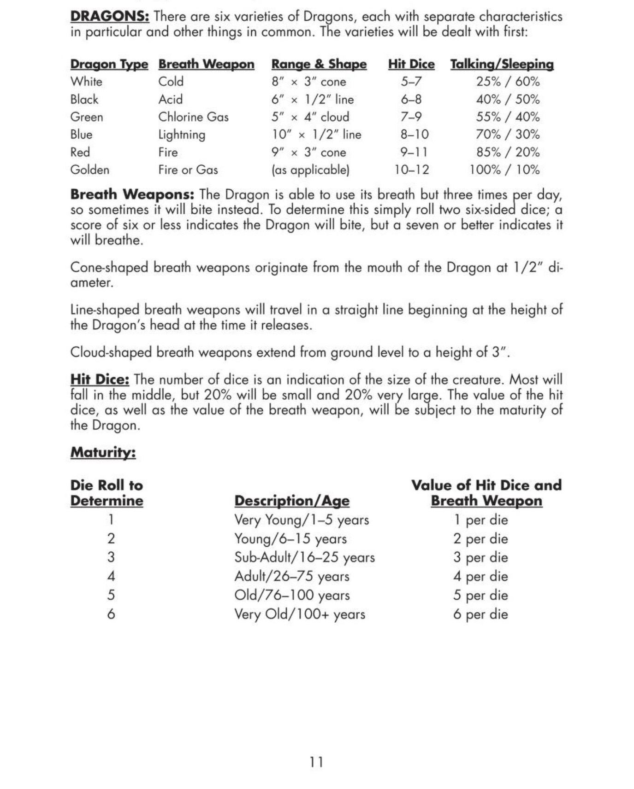

# Monsters & Treasure (1974) {#main .plain .wyrmlings}

> Gary Gygax and Dave Arneson, _Monsters & Treasure, vol. 2 of Dungeons & Dragons_ (Lake Geneva, WI: Tactical Studies Rules, 1974).

**DRAGONS:** There are six varieties of Dragons, each with separate characteristics in particular and other things in common. The varieties will be dealt with first:

| Dragon Type | Breath Weapon | Range & Shape | Hit Dice | Talking/Sleeping |
| :--- | :--- | :--- | :---: | :---: |
| White | Cold | 8" × 3" cone | 5–7 | 25% / 60% |
| Black | Acid | 6" × 1/2" line | 6–8 | 40% / 50% |
| Green | Chlorine Gas | 5" × 4" cloud | 7–9 | 55% / 40% |
| Blue | Lightning | 10" × 1/2" line | 8–10 | 70% / 30% |
| Red | Fire | 9" × 3" cone | 9–11 | 85% / 20% |
| Golden | Fire or Gas | (as applicable) | 10–12 | 100% / 10% |

**Breath Weapons:** The Dragon is able to use its breath but three times per day, so sometimes it will bite instead. To determine this simply roll two six-sided dice; a score of six or less indicates the Dragon will bite, but a seven or better indicates it will breathe.

Cone-shaped breath weapons originate from the mouth of the Dragon at 1/2" diameter.

Line-shaped breath weapons will travel in a straight line beginning at the height of the Dragon's head at the time it releases.

Cloud-shaped breath weapons extend from ground level to a height of 3".

**Hit Dice:** The number of dice is an indication of the size of the creature. Most will fall in the middle, but 20% will be small and 20% very large. The value of the hit dice, as well as the value of the breath weapon, will be subject to the maturity of the Dragon.

## Maturity

| Die Roll to Determine | Description/Age | Value of Hit Dice and Breath Weapon |
| :---: | :--- | :--- |
| 1 | Very Young/1–5 years | 1 per die |
| 2 | Young/6–15 years | 2 per die |
| 3 | Sub-Adult/16–25 years | 3 per die |
| 4 | Adult/26–75 years | 4 per die |
| 5 | Old/76–100 years | 5 per die |
| 6 | Very Old/100+ years | 6 per die |

